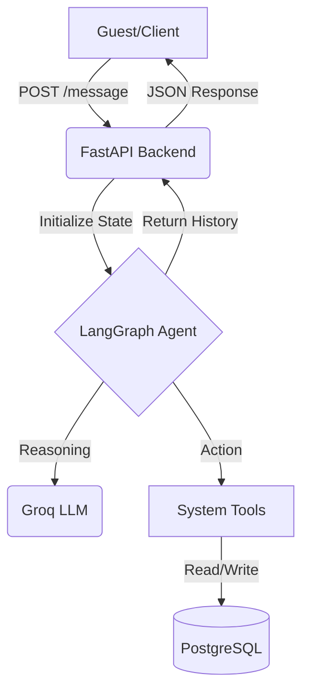

# StayEase Backend Architecture

StayEase is an asynchronous FastAPI service powered by an AI agent built with LangGraph, backed by PostgreSQL for persistence.

## 1. Architecture Document

### 1.1 System Overview

StayEase is an AI-powered short-term accommodation rental platform designed for Bangladesh. At its core, it uses a stateful LangGraph agent that can independently handle property search, fetch details, and create bookings.

The system is built on three main layers:

* FastAPI for API handling
* PostgreSQL for storing listings and conversation history
* Groq/Llama-3 models for reasoning and decision-making



---

### 1.2 Conversation Flow Walkthrough

**Scenario:** A guest is looking for a room in Cox's Bazar.

1. **Guest:**
   “I need a room in Cox's Bazar for 2 nights for 2 guests starting tomorrow.”

2. **API Layer:**
   The request comes into the FastAPI backend. The message is stored in the `conversations` table, and the full context is passed to the LangGraph agent.

3. **Agent Node:**
   The LLM analyzes the intent and recognizes this as a *search request*. It decides to call the `search_available_properties` tool.

4. **Tools Node:**
   The system queries PostgreSQL for listings in “Cox’s Bazar” that can accommodate at least 2 guests.

5. **Agent Node (response generation):**
   The LLM receives results like “Sea View Suite – 5000 BDT/night” and generates a user-friendly response:
   *“I found a Sea View Suite for 5000 BDT per night. Would you like more details?”*

6. **API Layer:**
   The response is sent back to the user and the assistant message is saved in the database.

---

### 1.3 LangGraph State Design

| Field               | Type                                         | Description                                                                                     |
| :------------------ | :------------------------------------------- | :---------------------------------------------------------------------------------------------- |
| `messages`          | `Annotated[List[BaseMessage], operator.add]` | Keeps the full conversation history so the LLM always has context of the dialogue.              |
| `escalation_status` | `str`                                        | Tracks whether the conversation has been escalated to a human or is still handled by the agent. |

---

### 1.4 Node Design

* **`agent`**
  This is the main reasoning node where the LLM runs. It interprets user input and decides what to do next.

  * Updates: `messages` (adds assistant reply)
  * Next step: `tools` (if a tool is needed), `evaluate_escalation`, or `END`

* **`tools`**
  Executes whatever tool the agent requested (search, details, or booking).

  * Updates: `messages` (adds tool output)
  * Next step: returns back to `agent`

* **`evaluate_escalation`**
  Checks whether the user wants or requires human support.

  * Updates: `escalation_status`
  * Next step: `END`

---

### 1.5 Tool Definitions

| Tool                          | Input Parameters                                    | Output Format              | Usage                                               |
| :---------------------------- | :-------------------------------------------------- | :------------------------- | :-------------------------------------------------- |
| `search_available_properties` | `location` (str), `guests` (int)                    | List of available listings | Used when users search for stays in a specific area |
| `get_listing_details`         | `listing_id` (UUID)                                 | Full listing details       | Used when users ask about a specific property       |
| `create_booking`              | `listing_id`, `guest_name`, `check_in`, `check_out` | Booking confirmation       | Used when user confirms reservation                 |

---

### 1.6 Database Schema

* **`listings`**:
  `id`, `title`, `location`, `price_per_night_bdt`, `max_guests`, `is_available`

* **`bookings`**:
  `id`, `listing_id`, `guest_name`, `check_in`, `check_out`, `total_price`, `status`

* **`conversations`**:
  `id`, `conversation_id`, `role`, `content`, `created_at`

---

## Detailed Architecture Breakdown


This diagram shows how a user request moves through the system—from API to agent reasoning, tool execution, and database interaction.

---

## Getting Started

1. Create your `.env` file

   * Add `DATABASE_URL`
   * Add `GROQ_API_KEY`

2. Run migrations

   ```bash
   docker exec stay_ease-app-1 alembic upgrade head
   ```

3. Start the system

   ```bash
   docker-compose up --build
   ```

4. Test the API using the examples provided in `api.md`

---

If you want, I can also make it more “startup-grade / investor-ready” or more “interview submission polished” depending on what you’re aiming for.
