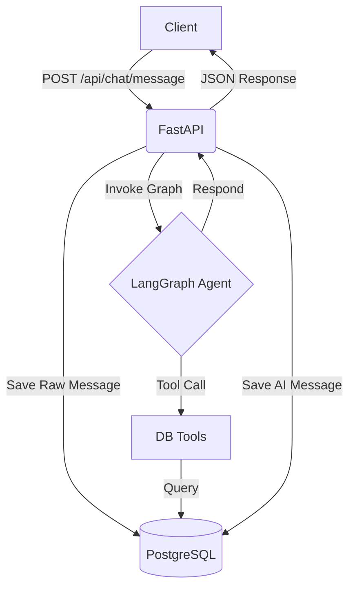

# StayEase Backend Architecture

StayEase is an asynchronous FastAPI service integrating an AI agent via LangGraph, backed by PostgreSQL.

## Architecture Overview

The system uses a stateful agent to handle property searches, details, and bookings. It supports human escalation if the user's request falls outside the agent's capabilities.

### Request Flow

## Database Schema

- **listings**: `id` (UUID), `title`, `location`, `price_per_night_bdt`, `max_guests`, `is_available`.
- **bookings**: `id` (UUID), `listing_id` (FK), `guest_name`, `check_in`, `check_out`, `total_price`, `status`.
- **conversations**: `id` (UUID), `conversation_id` (Indexed), `role`, `content`, `created_at`.

## LangGraph State

- **messages**: `Annotated[List[BaseMessage], operator.add]` - Conversation history.
- **escalation_status**: `str` - Either `"none"`, `"offered"`, or `"escalated"`.

## Getting Started

1. Set up `.env` with `DATABASE_URL` and `GROQ_API_KEY`.
2. Run migrations: `alembic upgrade head`.
3. Start server: `uvicorn app.main:app --reload`.
